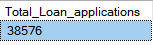
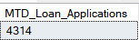
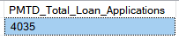
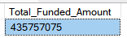
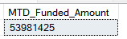
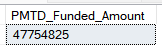
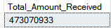
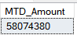

**BANK LOAN REPORT QUERY DOCUMENT**

**A: BANK LOAN REPORT | SUMMARY**

**KPI’s:**

KPI1

1. **Total Loan Applications**

SELECT COUNT(id) AS 'Total_Loan_applications'

FROM dbo.bank_loan_data;

2. **MTD Loan Applications:**

**MTD** stands for **Month-to-Date**. It refers to the period starting from the beginning of the current month up to the current date. In the context of your loan analysis project, MTD would represent all loan applications that have been submitted from the **first day of the current month** until **today**.

SELECT COUNT(id) AS MTD_Loan_Applications

FROM dbo.bank_loan_data

WHERE Month(issue_date) = (SELECT MONTH(MAX(issue_date)) FROM dbo.bank_loan_data)

AND

YEAR(issue_date) = (SELECT YEAR(MAX(issue_date)) FROM dbo.bank_loan_data);

3. PMTD Loan Applications:

SELECT COUNT(id) AS PMTD_Total_Loan_Applications

FROM dbo.bank_loan_data

WHERE MONTH(issue_date) = (SELECT MONTH(MAX(issue_date)) FROM dbo.bank_loan_data) - 1

AND

YEAR(issue_date) = (SELECT YEAR(MAX(issue_date)) FROM dbo.bank_loan_data);

KPI2

1. **Total Funded Amount:**

SELECT SUM(loan_amount) as Total_Funded_Amount

FROM dbo.bank_loan_data;

2. **MTD Funded Amount:**

SELECT SUM(loan_amount) AS MTD_Funded_Amount

FROM dbo.bank_loan_data

WHERE MONTH(issue_date) = (SELECT MONTH(MAX(issue_date)) FROM dbo.bank_loan_data)

AND

YEAR(issue_date) = (SELECT YEAR(MAX(issue_date)) FROM bank_loan_data);

3. **PMTD Funded Amount:**

SELECT SUM(loan_amount) AS PMTD_Funded_Amount

FROM dbo.bank_loan_data

WHERE MONTH(issue_date) = (SELECT MONTH(MAX(issue_date)) FROM dbo.bank_loan_data) - 1

AND

YEAR(issue_date) = (SELECT YEAR(MAX(issue_date)) FROM bank_loan_data);

KPI3

1. **Total Amount Received:**

SELECT SUM(total_payment) as Total_Amount_Received

FROM dbo.bank_loan_data;

2. **MTD Amount Received..**

SELECT SUM(total_payment) as MTD_Amount

FROM dbo.bank_loan_data

WHERE MONTH(issue_date) = (SELECT MONTH(MAX(issue_date)) FROM dbo.bank_loan_data)

AND

YEAR(issue_date) = (SELECT YEAR(MAX(issue_date)) FROM dbo.bank_loan_data);

3. **PMTD Amount Received…**

SELECT SUM(total_payment) as PMTD_Amount_Received

FROM dbo.bank_loan_data

WHERE MONTH(issue_date) = (SELECT MONTH(MAX(issue_date)) FROM dbo.bank_loan_data) - 1

AND

YEAR(issue_date) = (SELECT YEAR(MAX(issue_date)) FROM dbo.bank_loan_data);

KPI4

1. **AVG Interest Rate:**

SELECT AVG(int_rate)\*100 AS AVG_interest_rate

FROM dbo.bank_loan_data;

2. **MTD Avg Interest Rate:**

SELECT AVG(int_rate)\*100 AS AVG_MTD_interest_rate

FROM dbo.bank_loan_data

WHERE MONTH(issue_date) = (SELECT MONTH(MAX(issue_date)) FROM dbo.bank_loan_data)

AND

YEAR(issue_date) = (SELECT YEAR(MAX(issue_date)) FROM dbo.bank_loan_data);

3. **PMTD Avg Interest Rate:**

SELECT AVG(int_rate)\*100 AS AVG_PMTD_interest_rate

FROM dbo.bank_loan_data

WHERE MONTH(issue_date) = (SELECT MONTH(MAX(issue_date)) FROM dbo.bank_loan_data) - 1

AND

YEAR(issue_date) = (SELECT YEAR(MAX(issue_date)) FROM dbo.bank_loan_data);

KPI5

1. **AVG DTI:**

SELECT AVG(dti)\*100 AS AVG_dti

FROM dbo.bank_loan_data;

2. **MTD DTI:**

SELECT AVG(dti)\*100 AS AVG_MTD_dti

FROM dbo.bank_loan_data

WHERE MONTH(issue_date) = 12;

3. **PMTD DTI:**

SELECT AVG(dti)\*100 AS AVG_PMTD_dti

FROM dbo.bank_loan_data

WHERE MONTH(issue_date) = (SELECT MONTH(MAX(issue_date)) FROM dbo.bank_loan_data) - 1

AND

YEAR(issue_date) = (SELECT YEAR(MAX(issue_date)) FROM dbo.bank_loan_data);

GOOD LOAN vs BAD LOAN

1. **Good Loan Percentage:**

SELECT(COUNT(

CASE WHEN loan_status = 'Fully Paid' OR loan_status = 'Current' THEN id END)\*100.0)/

COUNT(id) AS good_loan_percentage

FROM dbo.bank_loan_data;

2. **Good Loan Applications:**

SELECT(

COUNT( CASE WHEN loan_status = 'Fully Paid' OR loan_status = 'Current' THEN id END)) AS good_loan_applications

FROM dbo.bank_loan_data;

3. **Good Loan Funded Amount**:

SELECT

SUM(loan_amount) AS Good_loan_funded_Amount

FROM dbo.bank_loan_data

WHERE loan_status IN ('Fully Paid', 'Current');

4. **Good Loan Amount Received..**

SELECT

SUM(total_payment) AS 'Good_Loan_Amount_Received'

FROM dbo.bank_loan_data

WHERE loan_status IN ('Fully Paid', 'Current');

5. **Bad Loan Percentage:**

SELECT (

COUNT(

CASE WHEN loan_status='Charged Off' THEN id END

)\*100.0 / COUNT(id)) as 'Bad_Loan_Percentage'

FROM dbo.bank_loan_data;

1. **Bad Loan Applications:**

SELECT

COUNT(id) as 'Bad_Loan_Applications'

FROM dbo.bank_loan_data

WHERE loan_status='Charged Off';

2. **Bad Loan Funded Amount:**

SELECT

SUM(loan_amount) AS 'Bad_loan_funded_Amount'

FROM dbo.bank_loan_data

WHERE loan_status='Charged Off';

3. **Bad Loan Amount Received:**

SELECT SUM(total_payment) Bad_Loan_Amount_Received

FROM dbo.bank_loan_data

WHERE loan_status='Charged Off';

Loan Status

1. **Loan Status:**

SELECT loan_status, COUNT(id) LoanCount,

SUM(total_payment) Total_Amount_Received,

SUM(loan_amount) Total_funded_Amount,

AVG(int_rate)\*100 avg_int_rate,

AVG(dti)\*100 avg_dti

FROM dbo.bank_loan_data

GROUP BY loan_status;

2. **Loan status:**

SELECT loan_status,

SUM(total_payment) MTD_Amount_Received,

SUM(loan_amount) MTD_funded_amount

FROM dbo.bank_loan_data

WHERE

MONTH(issue_date) = (SELECT MONTH(MAX(issue_date)) FROM dbo.bank_loan_data)

AND

YEAR(issue_date) = (SELECT YEAR(MAX(issue_date)) FROM dbo.bank_loan_data)

GROUP BY loan_status;

1. **BANK LOAN REPORT | OVERVIEW**

**Month**

SELECT

MONTH(issue_date) as Month_Number,

DATENAME(mm, issue_date) AS Month_Name,

COUNT(id) AS total_loan_applications,

SUM(loan_amount) AS total_funded_Amount,

SUM(total_payment) AS total_amount_received

FROM dbo.bank_loan_data

GROUP BY MONTH(issue_date),

DATENAME(mm,issue_date)

ORDER BY MONTH(issue_date);

**STATE:** 

SELECT address_state AS State,

count(id) as total_loan_applications,

SUM(loan_amount) as total_funded_amount,

SUM(total_payment) as total_amount_received

FROM dbo.bank_loan_data

GROUP BY address_state

ORDER BY address_state;

**Term:**

SELECT term as Term, COUNT(id) AS total_loan_applications,

SUM(loan_amount) AS total_funded_amount,

SUM(total_payment) AS total_amount_received

FROM dbo.bank_loan_data

GROUP BY term;

**EMPLOYEE LENGTH:**

SELECT emp_length AS Employee_Length,

COUNT(id) as Total_loan_applications,

SUM(loan_amount) AS total_amount_funded,

SUM(total_payment) AS total_amount_received

FROM dbo.bank_loan_data

GROUP BY emp_length

ORDER BY emp_length;

**PURPOSE:**

SELECT purpose,

COUNT(id) AS total_loan_Applications,

SUM(loan_amount) as total_funded_amount,

SUM(total_payment) as total_amount_received

FROM dbo.bank_loan_data

GROUP BY purpose

ORDER BY purpose;

**Home Ownership:**

SELECT home_ownership,

COUNT(id) AS total_loan_applications,

SUM(loan_amount) as total_funded_amount,

SUM(total_payment) as total_amount_received

FROM dbo.bank_loan_data

GROUP BY home_ownership

ORDER BY home_ownership;

